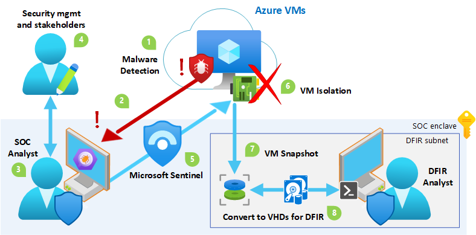
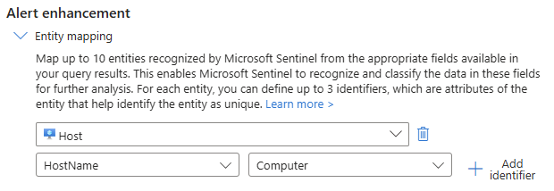
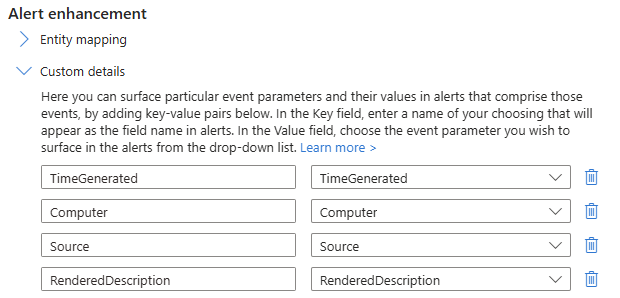

# How to Implement Automated Digital Forensics Incident Response in Azure

- [Executive Summary](#executive-summary)
  - [Scenario](#scenario)
  - [Overview](#overview)
- [Implement](#implement)
  - [DFIR Environment](#dfir-environment)
    - [Deploy Network](#deploy-network)
    - [Deploy Disk Access](#deploy-disk-access)
    - [Deploy Blob Storage](#deploy-blob-storage)
    - [Deploy Forensics VM](#deploy-forensics-vm)
  - [Playbook Automation](#playbook-automation)
    - [Deploy Logic App](#deploy-logic-app)
    - [Assign RBAC Roles](#assign-rbac-roles)
- [Test](#test)
- [Operate](#operate)
  - [Run the Playbook](#run-the-playbook)
  - [Access the VM](#access-the-vm)
  - [Convert Snapshots to VHDs](#convert-snapshots-to-vhds)

## Executive Summary

### Scenario

Contoso utilizes Azure with multiple subscriptions in a single tenant, including a dedicated subscription with SOC monitoring capabilities via Microsoft Sentinel. The entire tenant falls under the SOC's Area of Responsibility (AOR). All VMs within the AOR are equipped with an Endpoint Detection and Response (EDR) agent, excluding Microsoft Defender, and each VM has a single NIC with a private IP. This setup allows the SOC to effectively target and isolate VMs in response to nefarious activities, following Contoso's Incident Response (IR) plan.

### Overview

SOC operators require the capability to isolate and snapshot a VM through playbook automation for digital forensics incident response (DFIR) and reverse engineering. This SOC optimization solution enables rapid "quarantine in place" of an affected VM using security orchestration, automation, and response (SOAR). It also snapshots the running VM’s disks, allowing forensics analysts to convert and mount them for in-depth investigation and reverse engineering if necessary. The following overview details how the solution is utilized in such scenarios.



1. Malware or nefarious activity is detected on a VM, and an event is sent to Log Analytics.
2. A Microsoft Sentinel analytic rule creates an incident for the SOC to review.
3. The SOC reviews the incident and shares information with security management and stakeholders according to the IR plan and processes.
4. Security management and stakeholders confirm and authorize containment actions.
5. The SOC executes the **SOC-Isolate-AzVM** playbook automation in Sentinel.
6. The playbook automatically quarantines the Azure VM in place by denying all inbound and outbound traffic, achieving network isolation.
7. The playbook performs snapshots of the VM's OS, memory, and data disks to the SOC enclave before shutdown.
8. If the IR escalates and requires deeper analysis, an analyst can run a PowerShell script to convert the snapshots to VHDs for reverse engineering and forensics.

## Implement

This implementation guide will address the solution's prerequisites:
- A **DFIR environment** deployed in the SOC subscription: dedicated subnet, Disk Access, private endpoint, storage account, and a VM with reverse engineering and forensics tools.
- The **SOC-Isolate-AzVM** Logic App’s system-assigned Managed Identity requires:
  - **Reader**, **Network Contributor**, and **Virtual Machine Contributor** roles on all subscriptions within the SOC’s Area of Responsibility (AOR) which is the entire Tenant.
  - **Microsoft Sentinel Contributor** role in the Sentinel workspace to update Incidents with playbook automation results.
  - **Disk Snapshot Contributor** to save snapshots in the SOC subscription.
- To enable the Logic App to initiate snapshots on VMs in the Tenant, a custom Azure role named **Disk Snapshot Initiator** will need to be created and assigned to the Logic App on the scoped AOR.

### DFIR Environment

_Note: The specific names provided in this guidance are for Contoso's reference architecture. Feel free to adjust names, specifications, and design modifications to support your own architecture accordingly._

#### Deploy Network
- Logon to Azure portal with privileged account and elevate via Privileged Identity Management (PIM) to **Owner** of the SOC subscription.
- Create a dedicated subnet for DFIR in the SOC subscription’s virtual network (VNet). You can _potentially_ isolate further by putting it in its own dedicated VNet. 
  - Name: **incidentresponse**
  - CIDR: **x.x.x.x/yy**
  - NSG: **SOC-001-incidentresponse**
  - Service Endpoints: **Microsoft.Storage**
- Create the DFIR Resource Group (RG): **SOC-DFIR-RG**.

#### Deploy Disk Access

Create a Disk Access resource in the same RG to host the snapshot objects:
- Subscription: **`<SOC Subscription>`**
- Resource Group: **SOC-DFIR-RG**
- Name: **SOC-DFIR-DiskAccess**
- Under the _Private Endpoint_ section, click the **Add** button and create a private endpoint:

  - Subscription: **`<SOC Subscription>`**
  - Resource Group: **SOC-DFIR-RG**
  - Name: **soc-dfir-diskaccess-pe**
  - Virtual network: **`<VNet hosting the incidentresponse subnet>`**
  - Subnet: **incidentresponse**
  - Integrate with private DNS zone: **Yes**
  - Private DNS Zone: **`<Sentinel Workspace RG>` > privatelink.blob.core.`<fabricfqdn>`**
  
  Click the **OK** button.
- Click the **Create** button. When the deployment completes successfully, proceed to the next section.

#### Deploy Blob Storage

Create a Storage Account in the same RG to store the VHDs:

- _Basics_ page:
  - Subscription: **`<SOC Subscription>`**
  - Resource Group: **SOC-DFIR-RG**
  - Storage Account name: **socdfir01**
  - Primary service: **Azure Blob Storage**
  - Performance: **Premium**
  - Premium account type: **Block blobs**
  - Redundancy: **LRS**

- _Advanced_ page:
  - Require secure transfer for REST API operations: **Checked**
  - Allow enabling anonymous access on individual containers: **Unchecked**
  - Enable storage account key access: **Checked**
  - Minimum TLS version: **Version 1.2**
  - Permitted scope for copy operations: **From storage accounts in same Microsoft Entra tenant**
  - Enable hierarchical namespace: **Unchecked**
  - Enable SFTP: **Unchecked**
  - Enable network file system v3: **Unchecked**
  - Allow cross-tenant replication: **Unchecked**
  - Access tier: **Hot**

- _Networking_ page:
  - Network access: **Disable public access and use private access**

- _Data protection_ page:
  - Enable point-in-time restore for containers: **Unchecked**
  - Enable soft delete for blobs: **Checked** (Days to retain: **7days**)
  - Enable soft delete for containers: **Checked** (Days to retain: **7days**)
  - Enable soft delete for file shares: **Checked** (Days to retain: **7days**)
  - Enable versioning for blobs: **Unchecked**
  - Enable blob change feed: **Unchecked**
  - Enable version-level immutability support: **Unchecked**

- _Encryption_ page:
  - Encryption type: **Microsoft-managed keys (MMK)**
  - Enable support for customer-managed keys: **Blobs and files only**
  - Enable infrastructure encryption: **Checked**

- Click the **Create** button. When the deployment is completed successfully, click the **Go to resource** button.
- Navigate to the storage account and click **Security + networking > Networking**. In the details pane, click the **Private endpoint connections** tab. Click the **+ Private endpoint** button to add another private endpoint:

  - _Basics_ page:
    - Subscription: **`<SOC Subscription>`**
    - Resource Group: **SOC-DFIR-RG**
    - Name: **socdfir01-pe-blob**

  - _Resource_ page:
    - Target sub-resource: **blob**
  
  - _Virtual Network_ page:
    - Virtual network: **`<VNet hosting the incidentresponse subnet>`**
    - Subnet: **incidentresponse**
    - Private IP configuration: **Dynamically allocate IP address**
    - Integrate with private DNS zone: **Yes**
    - Subscription: **`<SOC Subscription>`**
    - Resource group: **`<Sentinel Workspace RG>`**

  - Click the **Create** button.
- In the navigation pane for the storage account, click **Data Storage > Containers**. In the details pane, click the **+ Container** button to create one named **vhd**.

#### Deploy Forensics VM

Deploy a Windows VM into the environment to support digital forensics and reverse engineering:
- Subscription: **`<SOC Subscription>`**
- Resource Group: **SOC-DFIR-RG**
- Virtual network: **`<VNet hosting the incidentresponse subnet>`**
- Subnet: **incidentresponse**
- Ensure the VM is configured with adequate specifications to support the required performance and disk space (processors, memory, SSDs, etc).
- Once the VM is deployed and its virtual drives are formatted, create a folder on the data drive where the VHDs will be downloaded to the VM to mount in a read-only manner with your forensic tools of choice. Document the local path for the next few steps.
- Copy the accompanying [**Convert-SnapshotsToVHD.ps1**](Convert-SnapshotsToVHD.ps1) PowerShell script to the forensics VM.
- In PowerShell ISE, edit the variables in the **Variables** section of the script to match your environment. Save the script for future use.

  

- Open an elevated PowerShell prompt execute the following command to ensure the required PowerShell modules are installed.
  ```
  Install-Module Az.Accounts, Az.Resources, Az.Storage, Az.Compute -Force 
  ```
- Log off the VM.

### Playbook Automation

#### Deploy Logic App

- Logon to Azure portal with privileged account and PIM to **Owner** of the SOC subscription.
- Record the applicable Azure fabric **Resource Manager Url** by performing the following commands in PowerShell:

  ```
  Import-Module Az.Resources
  Get-AzEnvironment
  ```
  

- Search Azure services for **Deploy a custom template** and then open it.
  - On the _Select a template_ page, click **Build your own template in the editor** link. Copy the contents of the [**azuredeploy.json**](azuredeploy.json) file and overwrite all of the template code in the Azure portal. Click the **Save** button. 
  - On the _Basics_ page, select the Subscription for the SOC enclave (**`<SOC Subscription>`**) and the Resource Group that hosts the Sentinel workspace (**`<Sentinel Workspace RG>`**). Click the **Next** button.
  - On the _Review + create_ page, click the **Create** button.
- Once the deployment succeeds, open the **SOC-Isolate-AzVM** Logic App and click **Logic app designer** to edit. Click the **Parameters** button in the top menu and edit the following to match your environment.
  - **Resource Manager Url** – Enter the applicable Azure fabric if it's different than the default value (**`https://management.azure.com`**). Be sure to _not_ include any trailing slash.
  - **AllowRemoteInboundCIDR** – (Optional) Enter the CIDR that aligns to an isolated IR subnet that will be allowed to remotely connect to a targeted and potentially compromised VM. The default value (**127.0.0.0/8**) effectively keeps the VM isolated.
  - **SnapshotSubscriptionId** – Enter the **SubscriptionId** hosting the DFIR environment.
  - **SnapshotRG** – Enter the name of the DFIR Resource Group (RG) that was deployed.
  - **SnapshotDiskAccessName** – Enter the name of the Disk Access resource that was deployed.
  
  Click the **Save** button to save the settings to the Logic App.

### Assign RBAC Roles

-	Ensure you have the necessary `Microsoft.Authorization/roleAssignments/write` permissions at the targeted scope, such as **User Access Administrator** or **Owner**.
-	Open the accompanying PowerShell script [**Set-ManagedIdentity.ps1**](Set-ManagedIdentity.ps1) in PowerShell ISE and step through the semi-automated process of configuring the RBAC role assignments for the Logic App’s system-assigned Managed Identity. The script effectively does the following:
    - Creates a custom Azure role named **Disk Snapshot Initiator** with the following least privileges to enable the Logic App to initiate snapshots on VMs within its scoped AOR:
      ```
      Microsoft.Compute/disks/beginGetAccess/action
      Microsoft.Compute/disks/endGetAccess/action
      Microsoft.Compute/snapshots/beginGetAccess/action
      Microsoft.Compute/snapshots/endGetAccess/action
      ```
    - Assigns **Reader**, **Network Contributor**, **Virtual Machine Contributor** and **Disk Snapshot Initiator** roles on the scoped AOR (Tenant by default).
    - Assigns **Disk Snapshot Contributor** role on the SOC subscription to grant the Logic App the ability to save snapshots in the subscription for digital forensics.

## Test

Perform the following steps to conduct a proof-of-concept (POC) test in production in a controlled manner:
- Deploy test VM(s) with Azure Monitoring Agent (AMA) enabled and sending events to the Log Analytics (LogA) workspace (**loga-workspace**).
- Configure a Sentinel analytic rule that will generate a "synthetic" malware incident:
  -	Connect to the Sentinel workspace for the SOC and navigate to the **Analytics** menu item.
  -	Click the **Create > Scheduled query rule** menu item.
  -	On the _General_ page, enter **SOC - POC TEST - Malware detected by Endpoint Security** in the _Name_ field and provide a brief description in the _Description_ field. Set the _Severity_ field to **High**. In the _MITRE ATT&CK_ drop-down menu, drill down through **Execution > T1204 - User Execution** and select the **T1204.002 - Malicious File** checkbox. Ensure the _Status_ field is **Enabled** and then click the **Next** button.
  -	On the _Set rule logic_ page, enter the following KQL in the _Rule query_ field:
    ```
    // Retrieve latest Heartbeats from test VMs in the past day
    workspace("loga-workspace").Heartbeat
    | where TimeGenerated > now(-1d)
    | where ComputerEnvironment == "Azure" and ResourceType == "virtualMachines"
    | where Computer == "<Windows Computer>" or Computer == "<Linux Computer>"
    | summarize arg_max(TimeGenerated, *) by _ResourceId
    // Append a "synthetic" malware event for each test VM
    | extend RenderedDescription = "EventID=1278  T1204.002 HOST\\UserName ran C:\\Windows\\System32\\notepad.exe, which attempted to access C:\\Users\\UserName\\Documents\\AVIndustryTestFilename.txt. The Test named AVIndustry test file was detected and deleted."
    | extend Source = "Endpoint Security"
    | project TimeGenerated, Computer, Source, RenderedDescription, _ResourceId
    | sort by TimeGenerated
    ```
    Modify the LogA workspace name and computer names in the above KQL query to match the target environment and POC.

  - Under _Alert enhancement_, expand _Entity mapping_ and click **Add new entity**. Add **Host** and then add **HostName** in the left drop-down menu and **Computer** in the right drop-down menu. 

      

  - Expand _Custom Details_ and then click **Add new**. Configure the following custom details:

      

  - Expand _Alert Details_ and enter **POC TEST - SOC - Malware detected on endpoint** in the _Alert Name Format_ field. Enter the following in the _Alert Description Format_ field:
    ```
    Endpoint Security detected malware on {{Computer}} at {{TimeGenerated}} and generated the following event:

    {{RenderedDescription}}
    ```
  
  - Under the _Query scheduling_ section, configure the query to run every **1 Days** and to lookup data from the last **1 Days**. Ensure the _Start running_ field is set to **Automatically**.
    Keep the rest of the settings default and then click the **Next** button to continue.
  - On the _Incident settings_ page, ensure _Create incidents from alerts triggered by this analytics rule_ option is set to **Enabled**. Configure the _Group related alerts, triggered by this analytics rule, into incidents_ option to be **Enabled** as well.  Click the **Next** button to continue.
  - On the _Automated response_ page, click the **Next** button to continue.
  - On the _Review and create_ page, wait until the wizard passes validation and then click the **Save** button.
- This will result in AMA on the test VM(s) pulsing heartbeats to the LogA workspace that will then be analyzed by Sentinel and a "synthetic" malware incident will be created.
- Proceed to the next section to run the **SOC-Isolate-AzVM** playbook.

## Operate

### Run the Playbook

If an incident response (IR) requires a VM to be isolated, perform the following steps:
-	Select the Incident in Sentinel and then click **Actions > Run playbook** in the Action pane. Click the **Run** button for the **SOC-Isolate-AzVM** playbook.
-	The playbook will immediately execute against all **Host** entities in the associated Incident and perform the following (per VM):
    -	Queries Azure Resource Graph (ARG) to determine the path to the VM’s Resource ID.
    -	Creates a dedicated NSG for the VM in a 1:1 manner with the name of **SOC-IsolateVM-<_VMHostName_>-NSG** in the same RG as the VM. The NSG has rules that block all inbound and outbound traffic. 
        
    -	Associates the NSG to the VM’s NIC to apply network isolation.
    -	Performs snapshot(s) of VM OS, memory, and data disk(s) to SOC enclave with the following naming convention (where time is in **UTC**):
        -	OS disk: **<_VMHostName_>_DiskOS_yyyy-MM-dd-HHmm**
        -	Data disk(s): **<_VMHostName_>_LUNn_yyyy-MM-dd-HHmm**
    -	Shuts the VM down to fully commit the NSG rules to the VM. If powered back up, it’s completely isolated.
    -	Updates the Incident in Sentinel with the status of the automated isolation and VM snapshot.
-	Network isolation is quickly achieved on the targeted VM(s) within seconds. The overall process takes several minutes per VM with over 90% of the time devoted to performing snapshot(s) and VM shutdown procedures after VM isolation.

### Access the VM

If controlled connectivity to the VM is required during the IR (for deeper analysis), then a manual edit of one inbound NSG rule is required to allow remote access the VM:
-	Navigate to the VM’s **SOC-IsolateVM-<_VMHostName_>-NSG** NSG.
-	Modify the **SOC-AllowRemoteInbound** rule to have a Priority of **100** and change the Source CIDR to match the source VNet accordingly.
    
-	Start the VM so that the updated NSG rule is fully applied.
-	Access the VM via remote connection in a controlled manner.
-	Once analysis is completed on the VM, change the **SOC-AllowRemoteInbound** rule to have a Priority of **4096** and change the Source CIDR to **127.0.0.0/8**.
-	Shutdown the VM to fully commit the NSG rules to the VM. If powered back up, it’s completely isolated again.

### Convert Snapshots to VHDs

If the IR escalates to require forensic analysis or reverse engineering, use the [**Convert-SnapshotsToVHD.ps1**](Convert-SnapshotsToVHD.ps1) PowerShell script to convert the VM snapshot objects to create VHDs for deeper analysis.
- Remote to the DFIR VM in the DFIR subnet that should solely have access to the snapshots.
- Open an elevated PowerShell prompt and change directory to where the [**Convert-SnapshotsToVHD.ps1**](Convert-SnapshotsToVHD.ps1) PowerShell script resides. Execute the following command:
  ```
  .\Convert-SnapshotsToVHD.ps1 
  ```
- The script will prompt you to connect to Azure and will then present a menu of snapshot objects that the **SOC-Isolate-AzVM** playbook previously saved. Select the snapshot object(s) to be converted to VHD(s) and downloaded to the DFIR VM. Click the **OK** button.

  
  
  **Remember:** The snapshots use the following naming convention (where time is in **UTC**):
  -	OS disk: **<_VMHostName_>_DiskOS_yyyy-MM-dd-HHmm**
  -	Data disk(s): **<_VMHostName_>_LUNn_yyyy-MM-dd-HHmm**

  **Tip:** You can hover over a cell in the **SourceDisk** column to illuminate the path to the original disk to enable an informed selection. 
- Mount the VHD(s) in your forensics tool of choice.
- Be sure to perform lifecycle management on the VHDs and snapshot objects in accordance with your incident response procedures.
